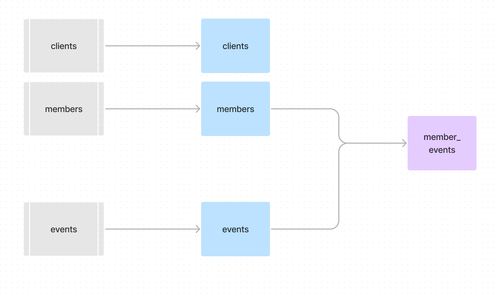

# Analytics Engineer Prompt - Product Analytics

## Background
At Wellthy, we support families in caring for their loved ones, whether it's for their spouse, parents, children, or a dear friend. We do this by seamlessly integrating technology and personalized care support to help caregivers tackle the logistical and administrative tasks of caring for the ones they love, including themselves.

This process starts with a caregiver creating an account on the Wellthy platform. From there they can create a Care Project and be assigned a Care Coordinator who will assit them throughout their care journey. If you are interested in learning more about Wellthy’s services, you can read more at [here](https://wellthy.com/).

Wellthy’s primary source of revenue is through employer benefit programs: companies (our clients) will sign a contract to offer Wellthy as a benefit to their eligible employees. To increase revenue, retention, and expand our client base, our user experience should be as intuitive and empathetic as possible for caregivers and their families. Therefore, it is important that our signup and conversion process is a smooth one, ensuring a caregiver gets the help they need as quickly as possible. 

To understand how our members interact with the Wellthy platform, the Data Team, in partnership with Product & Engineering, uses [Snowplow](https://snowplow.io/) to capture event data for analysis. Specific knowledge of Snowplow is not required for this challenge, but a general understanding of event schemas and capturing user events is.

The Data Team also uses dbt to build and maintain our data transformations. dbt is an open-source command line tool that lets data teams quickly and collaboratively deploy analytics code using software engineering best practices. For more information about dbt you can reference the documentation [here](https://docs.getdbt.com/docs/introduction), or test it out by following their [online tutorial](https://courses.getdbt.com/collections). While not required for this interview, an understanding of dbt project structures and best practices is helpful.

For the purpose of this challenge, think of dbt as a tool that enables you to build and test tables (data models) using `SELECT` statements. Each data model created in a dbt project is stored in a `.sql` file. Since data models are often dependent on each other, dbt creates a directed acyclic graph (DAG) that allows you to see these dependencies. This is done by using jinja (e.g.,`{{ ref('some_model_name') }}`) to reference tables in the `FROM` clause.

Data models can be configured and data tests and documentation can be added using YAML files. Click [here](https://docs.getdbt.com/docs/building-a-dbt-project/tests) for more information about dbt tests or [here](https://docs.getdbt.com/docs/building-a-dbt-project/documentation) for more information about documentation.

## Scenario
The Head of Product comes to the Data Team with the suspicion that drop-off rates for prospective members have been increasing over the last several months, meaning prospective members are quitting somewhere during the signup process and not creating Care Projects. One PM hypothesizes that this is due to a new page they added to the intake process last quarter, another thinks members are getting stuck on a confusing page. Before the Product Team makes any changes, the Data Team's Analyst needs to analyze event data from the Wellthy website and deliver their findings to the Product Team so they can make an informed decision on whether 1) there is even a problem, and, if so, 2) where and why the problem(s) is/are occurring.

For this exercise, we define conversion as someone first creating a Wellthy account, then stepping through all the below steps to eventually create a Care Project:

1. Create Wellthy Account
2. Input Full Name
3. Confirm Country of Residence
4. Verify Eligibility
5. Referral Source (How did you hear about Wellthy?)
6. Tell us your Caregiving Goal
7. Create Care Project

## Here are some of the business questions that analyst would like to be able to answer:
* Which step in the Member Intake funnel has the largest dropoff?
    * Is this dropoff consistent across our user base, or does it affect some subsets of users more than others?
* What percent of new signups make it through the Member Intake Funnel (i.e., convert), from Creating Account to their first Care Project? 
    * How has this changed over time?
* Do conversion rates vary across our clients?
* Which pages in the Member Intake funnel are users most likely to skip?
* What is the average amount of time a user is spending on each page in the Member Intake Funnel?

## Challenge
An analytics engineer on the team has begun modeling event data out to allow the analyst to more easily answer these questions. The engineer has submitted a pull request (PR) for you to review. 

Prior to your technical interview, please review the files in the `base`, `intermediate`, and `prod` subdirectories, as well as the JSON file, and pretend you are giving a real PR review. Make note of any questions you might have about the sample data model; you will have an opportunity to ask them during the interview. 

## The Technical Interview
During your interview, we will discuss your PR review in a collaborative session. You will not be asked to do any coding yourself, but please be prepared to share your screen and discuss what changes, suggestions, or questions you would include in your review. Please note: you do not need to submit anything ahead of the interview or prepare a presentation of any kind.

## Event Data (Snowplow)
The source table for event data is `atomic.events` in a data warehouse, where every tracked event made by a user on the Wellthy application is stored. You can think of "events" as actions a user can perform in an application: a user "viewed" a page, "clicked" a link, "submitted" a form, etc. You can also define custom events in Snowplow unique to your application. In our case, we've included in this repo the event schema for a custom event called "Member Intake Funnel". 

Note: If you are familiar with Snowplow data, you will notice that not all columns typically provided in `atomic.events` are in the `SELECT` statement that creates the `base` model. They have been excluded for simplicity's sake and are not relevant to the challenge.

## dbt Model structure
Our dbt structure is separated across multiple databases and schemas in Snowflake, and transformations are performed in different "layers" to reduce the repetition of logic across multiple models:
* The `prep` database contains all of the early transformations that are not directly accessed by BI Tools or external processes.
    * The `base` schema contains a 1-1 relationship with the source tables and includes the individual table transformations and column aliasing. Every source table should have a corresponding `base` model.
    * The `intermediate` schema contains early combinations of records that are used as stepping stones to produce additional downstream transformations. This separation will allow for leveraging the same models downstream without repeating the same code multiple times.
* The `prod` database contains the "final" transformations to produce the models that are accessed directly by BI Tools and external processes.

## Lineage Graph
 ** REPLACE THIS PNG IMAGE ***

## Assumptions
Since this is an incomplete directory without access to the source data, you are unable to run the models yourself to verify their accuracy. As such, please assume the following:
* `dbt run` results in a successful build of all models.
* `dbt test` results in a successful test of all models.
* All events are firing correctly in Snowplow
